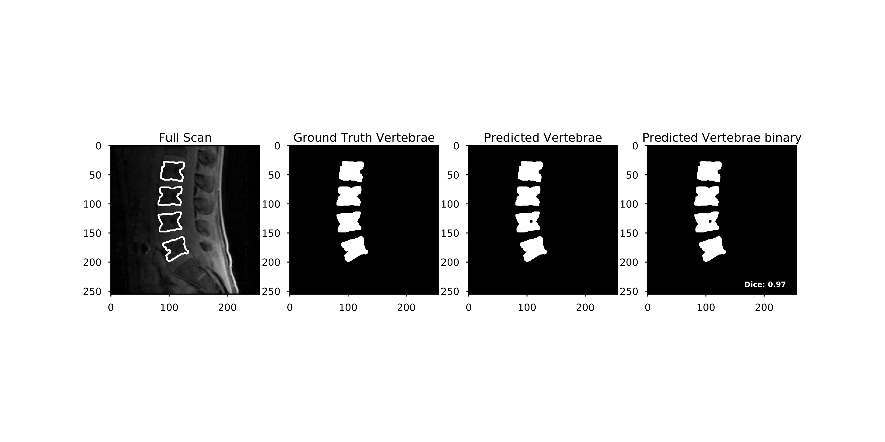

# VerteSeg: Automatic Vertebral Segmentation

Get DICOM masks of vertebrae from **sagittal IDEAL** (**I**terative **D**ecomposition of water and fat with **E**cho **A**symmetric and **L**east-squares estimation) **spine MR images**<br />
These masks are generated from a U-net ([Ronneberger et al., 2015](https://arxiv.org/abs/1505.04597)) that was trained on the water, fat, fat fraction, and R2* IDEAL images and manual segmentations.

This function should work on any UCSF Dept. of Radiology SCS Linux environment.
Make sure to switch to the `bash` environment.

## Setup
### Installing a virtual environment on SCS
*Adapted from the [UCSF Dept. of Radiology wiki](https://wiki.radiology.ucsf.edu/bin/view/SCS/Tutorials/PythonIntro/)*<br />
Set up a conda environment if you do not have all the packages/compatible versions (the list of dependencies is listed in `environment.yml`).<br />

**Set path to desired Anaconda installation**<br />
Set your path to a specific Anaconda installation (in this case, **Anaconda 3**) in `/netopt` in your `.bashrc` profile:
1.  `nano ~/.bashrc`<br />
2.  Add the following to the end of the file<br />`export PATH="/netopt/rhel7/versions/python/Anaconda3-5.0.0.1/bin:$PATH"`<br />

**Create and/or modify `.condarc`**<br />
In the SCS, we need to change the default location that environments and packages are installed so that our `/home` directory does not run out of space.
1.  Create a file called `.condarc` in your `/home` folder<br />
2.  `chmod u-w /.conda/pkgs`. This is to prevent writing to the pkgs dir in the default pkg location in `/home` <br />
3.  Add in the following information to `~/.condarc`:<br /> 
```
envs_dirs:
 - /path/to/your/new/location/for/envs
pkgs_dirs:
 - /path/to/your/new/location/for/pkgs
```
Valid installation paths include:
```
/netopt/bin/local/${group_name}
/netopt/lib/local/${group_name}

/data/*

/working/*
```
*NOTE: please create your `~/.condarc` file using a unix based editor like `vi`, `emacs`, or `nano` using a NotePad on Windows or TextEdit on Mac will cause problems.

**Create and activate virtual environment using conda**<br />
Set-up environment using conda (make sure you are in the `verteseg` code repository):
`conda env create -f environment.yml`<br />
The default name of the environment is `vseg`. Activate the environment with `source activate vseg`, and deactivate with `source deactivate`.<br />
Use `conda info vseg` to see more information about the environment and ensure that it was installed properly.

## Usage

Make sure you are in the `verteseg` code repository.
```
source activate vseg
python get_masks.py [-h] --data_path "/path/to/your/data/" --exam "E1234" --series "5" --save_path "/path/to/save/masks/"
```
This assumes that your data is organized such that the fat fraction DICOM series is located in `/path/to/your/data/E1234/5/`<br />
Masks will be saved as `/path/to/save/masks/E1234/5/E1234S501I_mask_pred_#.DCM` where # is the slice number.

## Further steps

To automatically convert the DICOM masks into regions of interest (ROIs) in IDL:
```
idl
brimage,/load
files = file_search("/path/to/save/masks/E1234","*DCM")
MaskToMir,files
```
These automatically generated ROIs, saved as a `.mir` file, can then be visualized in IDL's interactive environment,
accessed by the command `brimage` or `mrsc_image`:
1. Open an IDEAL series (e.g. the water series) that you want to overlay the masks on.
2. On the image viewer, click "Tools > ROIs", then click the name of the image series (outlined in green) to display a drop-down menu, 
and select "Open ROI file" to open your `.mir` file. This will display the masks.
3. To view as an overlay, click the name of image series above the green outlined text and select the name of the series 
corresponding to what you want the masks to be overlaid on.

All tools in IDL can be used as normal to modify the ROIs as needed.
<br /><br />
This can also be done manually by:
```
idl
brimage,/load
MaskToMir,/interactive
```
This opens an interactive version of the `MaskToMir` function, in which you can select the `.DCM` or `.int2` file corresponding to your mask, and 
automatically make a `.mir` file with default parameters.

## Credits

This was created by the [Musculoskeletal Magnetic Resonance Imaging Lab](https://profiles.ucsf.edu/roland.krug).<br />
Please contact [Jiamin Zhou, MS](https://profiles.ucsf.edu/jiamin.zhou) if you have any questions or comments.